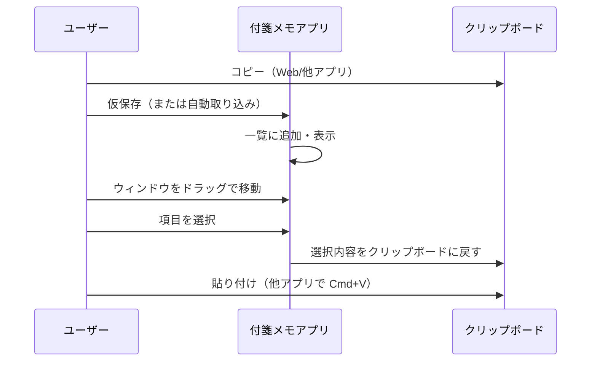

# 付箋メモアプリ 要件定義書

## 1. はじめに

### 1.1 目的

個人利用の「仮ペースト用・常時最前面付箋メモ」アプリの開発範囲と仕様を確定する。

### 1.2 対象読者

- 開発者（自分）
- 将来の仕様確認用

### 1.3 前提

- MacBook、複数モニター環境で利用する
- 主にテキストのコピー／仮保存／貼り付けのワークフローを支援する

---

## 2. 背景・目的・実現可能性

### 2.1 背景

Mac 純正の Stickies（付箋）アプリはデスクトップに固定表示されるため、他のアプリウィンドウの背後に隠れやすく、常に見える状態で使いたいときに不便である。他ウィンドウの上に常時表示しておきたいニーズがある。

### 2.2 目的

「コピー → 仮保存 → すぐ貼り付け」の**仮置き場**として、**常に最前面**で使える軽量メモアプリを実現する。

### 2.3 システムとして可能か

**可能である。**

macOS ではウィンドウの「常に最前面」（Always on Top）は標準 API で実現可能。Electron / Tauri / ネイティブ（Swift/AppKit）いずれでも実装できる。

---

## 3. 用語・スコープ

| 用語 | 定義 |
|------|------|
| 仮ペースト先 | クリップボード内容を一時的に保持・表示するエリア |
| 常に最前面 | 他のアプリのウィンドウより前面に表示し続けること |
| 本アプリのスコープ | デスクトップウィジェット的な「常時最前面のメモ／仮ペースト用ウィンドウ」。汎用クリップボードマネージャーや履歴のみのツールとは区別する |

---

## 4. ユーザー・利用シーン

### 4.1 ユーザー

個人（自分）。複数モニターで作業し、空いたモニターにメモを常時表示したい。

### 4.2 利用シーン

- WEB やドキュメントからテキストをコピー → アプリに「仮保存」→ 別の作業場でその内容をすぐ貼り付け
- 複数コピーを順不同で仮保存し、並び順を変えてから必要なものを貼り付け
- ウィンドウをマウスでつまんで、モニター間やデスクトップ上の好きな位置にサクサク移動

### 4.3 利用フロー（概要）

---

## 5. 機能要件

### 5.1 必須要件

| 要件ID | 分類 | 要件概要 |
|--------|------|----------|
| F-01 | 表示 | ウィンドウを**常に最前面**に表示する |
| F-02 | 表示 | ウィンドウの位置・サイズをユーザーが自由に変更できる |
| F-03 | 操作性 | **ドラッグでウィンドウ移動**が軽快である（クリック＆ホールドでつまんで動かす） |
| F-04 | コア | コピー（クリップボード）内容を**仮保存**し、一覧またはメモとして表示する |
| F-05 | コア | 仮保存した項目を**クリック等で選択し、貼り付け可能な状態にする**（クリップボードに戻す、または選択状態でペースト操作に対応する） |
| F-08 | 環境 | **複数モニター**で、任意のモニターにウィンドウを配置できる |
| F-09 | 環境 | MacBook（macOS）で動作する |

### 5.2 推奨要件

| 要件ID | 分類 | 要件概要 |
|--------|------|----------|
| F-06 | 拡張 | **コピー履歴**を保持する（直近 N 件など） |
| F-07 | 拡張 | 履歴の**並び順を変更**できる（ドラッグで並べ替え等） |

※ 要件 ID はトレーサビリティ用。

---

## 6. 非機能要件

### 6.1 パフォーマンス・体感

- **軽量**: 起動が速く、メモリ・CPU 負荷が小さいこと
- **サクサク動作**: ウィンドウのドラッグ移動がカクつかず軽快であること

### 6.2 可用性

- 常時起動、または必要時に起動して、ウィンドウを最前面に置いたまま利用できること

### 6.3 セキュリティ・プライバシー

- クリップボード・仮保存データは端末内に保持する（個人利用のため、ネット送信は行わない）

### 6.4 制約

- 対象 OS: macOS（具体的な対応バージョンは設計時に確定する）

---

## 7. 画面・UI イメージ（要件レベル）

- 常に最前面の**小〜中サイズのウィンドウ**
- ウィンドウの**タイトルバーまたは余白をドラッグ**して移動する（サクサク動かせること）
- **仮保存したテキストの一覧**を表示する。または「1 枚の付箋＋履歴」のようなシンプルな構成のいずれかを採用する（詳細は設計で決定）
- 並び順変更は、リスト形式でドラッグ＆ドロップにより行えることを想定する

### 7.1 UI 案（概要）

- **案 A**: 一覧形式。仮保存した項目をリスト表示し、クリックでクリップボードに戻す。並び替えはリスト内ドラッグ＆ドロップ
- **案 B**: 付箋＋履歴形式。現在の「1 枚の付箋」に直近の内容を表示し、履歴パネルで過去分を選択可能

※ 採用する案は設計フェーズで決定する。

---

## 8. 技術的検討・実現性

### 8.1 常に最前面

- **macOS ネイティブ**: `NSWindow.level` を `.floating` や `.screenSaver` より上のレベルに設定することで実現可能
- **Electron**: `BrowserWindow.setAlwaysOnTop(true)` で実現可能

### 8.2 軽量・軽快さ

- **ネイティブ（Swift/AppKit）**: 最も軽く、ドラッグの体感も良い
- **Tauri**: ネイティブに近い軽さで、Web 技術で UI を書ける
- **Electron**: やや重くなりがちなため、軽さを最優先する場合は Tauri またはネイティブを推奨

### 8.3 クリップボード監視

- **ネイティブ**: `NSPasteboard` の変更監視でコピー検知が可能
- **Electron**: clipboard モジュールとポーリングまたはイベントで対応可能

### 8.4 複数モニター

- 通常のウィンドウとして扱う限り、OS がモニター間のウィンドウ移動をサポートするため、特別な実装は不要

---

## 9. 成果物・アウトプット

- 本要件定義書（本ドキュメント）
- 必要に応じて、画面イメージ（ワイヤーフレーム）を別紙または同一ドキュメント内に簡易記載する

---

## 10. 今後の検討・オプション

- 起動時オートスタート（ログイン時起動）の要否
- 履歴の最大件数（例: 直近 20 件、50 件など）
- テキスト以外（画像など）の仮保存の要否（本要件定義ではテキストを主対象とする）
- ウィンドウのフレームレス化の要否（ドラッグ領域の確保方法に影響）

---

## 改訂履歴

| 版 | 日付 | 内容 |
|----|------|------|
| 1.0 | 2025-03-18 | 初版作成 |
